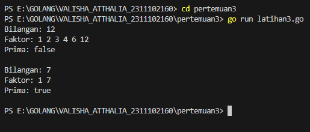
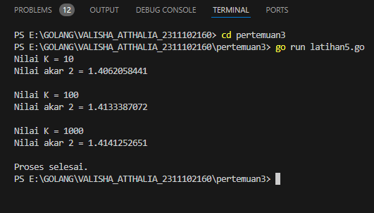

latihan 1

latihan 2
1. 
input 80.1 termasuk dalam nilai a sebab berdasarkan tabel kelulusan dimana > 80 dianggap lulus dengan nilai A

2. a. kesalahan terdapat pada bagian akhir, variabel "nmk" digunakan pada perintah fmt.Println("Nilai mata kuliah: ", nmk), padahal yang seharusnya digunakan adalah "nam", karena "nam" adalah variabel yang menyimpan nilai huruf (grade) mata kuliah.
b. Setiap kondisi if berdiri sendiri. Seharusnya menggunakan else if agar kondisi diperiksa secara berurutan dan berhenti ketika kondisi yang benar ditemukan. Jika tidak, program akan terus memeriksa semua kondisi meskipun ada kondisi yang telah terpenuhi.

3. 

latihan 3

latihan 4

latihan 5
